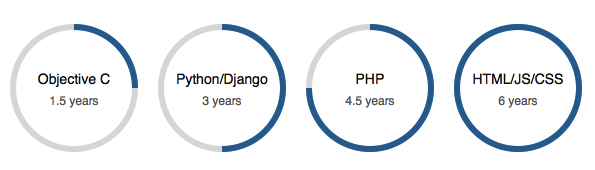

radius-progress-bar
===================

HTML5 Radius Progress Bar jQuery plug-in


Usage
_____


1. Include `jquery.radius-progress-bar.js` and `style.css` in your html file
2. Add `radius-progress` to your element class e.g. `<div class="radius-progress"></div>`
3. Define `data-current-progress` with a percentage integer value (0 - 100) for initial progress position
4. Define `data-progress` with a percentage integer value (0 - 100) for target progress position
5. Define `data-value` with a integer or float that states the maximum (100%) value of this progress bar
6. Define `data-unit` with a string to add unit label to the value defined in step 5
7. Set `data-auto-play` to `yes` will animate the progress immediately after the page has loaded, if you want to trigger the animation manually, you need to remove this attribute
8. Done!


A complete settings will be something like this

```
<div class="radius-progress" data-current-progress="0" data-progress="80" data-value="100" data-unit="%" data-auto-play="yes">
    <div class="label">Radius Progress<br/><small></small></div>
</div>
```

Tips
____

In case you are triggering the animation on the page scroll event, you will need to add one more line to prevent the animation being triggered repeatly.

the code is

```
if ($(this).attr('completed') == 'yes' || $(this).attr('working') == 'yes') return;
```

the `completed` attribute tells you if the animation has already been played, so you don't need to play it again

the `working` attribute tells you if the animation is currently playing

working example

```
if ($(window).scrollTop() >= $(window).height() - 300){
    $('.radius-progress').each(function(){
        if ($(this).attr('completed') == 'yes' || $(this).attr('working') == 'yes') return;
        $(this).raduisProgressBar();
    });
    
}
```


Demo
____


